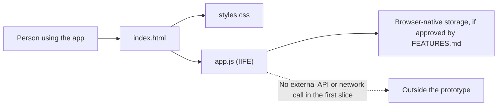

# ARCHITECTURE.md

Accountable: Giancarlo Martinez-Saldana, Phase 1 Architect. Prepared by Aashi Mehta since Architect is a silent member. Weights were committed before any option was scored.

## The Gate: Build, Buy, or Delegate

This gate applies to the first product slice described by the team: a casual,
photo-first travel diary for places a person has visited, with category
filtering. Ranking visited places by city and category is a future direction,
not a committed feature in this decision.

### Agreed Weights (recorded before scores)

The team agreed to these weights before draft option scores were assigned; the
agreement was reported in the project discussion on 2026-10-07.

| Criterion | Agreed weight (1 to 5) | Why this weight |
|---|---:|---|
| Satisfies the described review-and-filter flow | 5 | This is the existing product concept and the smallest useful slice. |
| Fits the supplied no-library, no-network-call standard | 5 | The team standard rules out adding a hosted dependency for the prototype. |
| Limits exposure of personal reviews and photos to non-followers | 5 | Photos and visit history can be sensitive; avoid sending them to a new service. |
| Buildable and testable by the team in Phase 2 | 4 | The first slice should be achievable with the repository's simple web stack. |
| Reversible if later requirements change | 3 | City/category rankings and multi-user sharing may change the data model. |

### Scores (1 to 5)

| Criterion | Weight | Build: Worker, D1, static page | Buy: reminder features in off-the-shelf invoicing software | Delegate: bolt.new-generated and hosted app |
|---|---|---|---|---|
| Satisfies the described review-and-filter flow | 5 | 5 | 2 | 4 |
| Fits the supplied no-library, no-network-call standard | 5 | 5 | 3 | 3 |
| Limits exposure of personal reviews and photos to non-followers | 5 | 4 | 2 | 2 |
| Buildable and testable by the team in Phase 2 | 4 | 4 | 2 | 4 |
| Reversible if later requirements change | 3 | 4 | 2 | 4 |
| **Weighted total (max 110)** | | **98** | **49** | **73** |

**Score rationale**

- **Build:** This is the strongest fit. The team can shape the review and category flow directly and keep the prototype browser-only, with no added server, database, or credentials. Buildability and reversibility get a 4 because storing photos in browser storage still needs testing, and a future ranking feature may require changing the data model.
- **Buy:** The team hasn't evaluated a specific product yet. A generic hosted review product or SDK fits the photo-first, category-filtered experience poorly. It would likely need network calls and a third-party service, which conflicts with the no-library, no-network-call standard and sends personal reviews and photos off-device. Buildability gets a 2 because the team would mostly be configuring and working around someone else's product, which leaves little to build and test in Phase 2. Reversibility gets a 2 because data and workflows would be tied to the vendor.
- **Delegate:** Could accelerate a prototype, but the team would still need to
  specify, verify, and own it. It has weaker fit with the no-library/no-call
  constraint and data-boundary preference. The required bolt.new probe is
  separately limited to specification testing; generated code is not kept.

## ADR-001: Build a Browser-Only Travel Review Prototype

- **Status:** Status: Accepted, 2026-010-07. Driver: Semaj. Approver: Rishika.

### Context

The product concept is a casual travel-review app where people add visited
places with photos, ratings, and reviews, then browse using a category filter.
The future idea is to rank places by city and selected category. The repository
does not yet contain application source code.

### Options

1. Build a static, browser-only prototype using the web platform.
2. Buy or adopt a hosted review product or third-party SDK.
3. Delegate the product implementation to a code-generation service.

### Proposed Decision

Build option 1 in-house for the first prototype. If approved, keep structure in `index.html`, presentation in `styles.css`, and behavior in `app.js`; put application behavior inside an IIFE. Do not add a framework, external API, hosted database, or credential.

### Consequences

- The prototype avoids exposing review and photo data to an added server or third-party SDK.
- It can be served as static files and tested without service credentials.
- Local-only storage limits data to the current browser and device; it does  not provide accounts, synchronization, recovery, or community rankings.
- Browser storage capacity and photo handling must be tested before promising
  reliable storage of uploaded images.
- A future shared ranking feature may require a backend and a revised architecture decision; it must not bypass the team's trust and SQL-binding standards.

### Revisit Trigger

Revisit if creating this becomes a real possibility for an actual client. 

## Architecture Diagram

