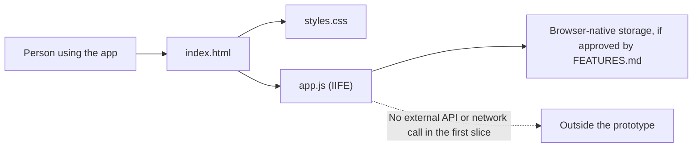

# ARCHITECTURE.md

Accountable: Giancarlo Martinez-Saldana, Phase 1 Architect. Prepared by Aashi
Mehta for the Architect's review. Status: Build/Buy/Delegate assessment
completed as a draft using weights the team reports agreeing to; the score
recommendations and architecture direction await the Architect's review.
Validate detailed requirements against the Specifier's `PROJECT.md`,
`USERS.md`, and `FEATURES.md` before implementation.

## The Gate: Build, Buy, or Delegate

This gate applies to the first product slice described by the team: a casual,
photo-first travel diary for places a person has visited, with category
filtering. Ranking visited places by city and category is a future direction,
not a committed feature in this decision.

### Agreed Weights (recorded before scores)

The team agreed to these weights before draft option scores were assigned; the
agreement was reported in the project discussion on 2026-10-06.

| Criterion | Agreed weight (1 to 5) | Why this weight |
|---|---:|---|
| Satisfies the described review-and-filter flow | 5 | This is the existing product concept and the smallest useful slice. |
| Fits the supplied no-library, no-network-call standard | 5 | The team standard rules out adding a hosted dependency for the prototype. |
| Limits exposure of personal reviews and photos | 5 | Photos and visit history can be sensitive; avoid sending them to a new service. |
| Buildable and testable by the team in Phase 2 | 4 | The first slice should be achievable with the repository's simple web stack. |
| Reversible if later requirements change | 3 | City/category rankings and multi-user sharing may change the data model. |

### Scores

Score each criterion from 1 (poor fit) to 5 (strong fit). Weighted total is
the sum of `weight × score`; weighted average is total divided by the sum of
weights (22). Scores are comparative draft judgments against the current concept and
standards, not measured user-research results or scores approved by the
Architect.

| Criterion | Weight | Build (score) | Build (weighted) | Buy (score) | Buy (weighted) | Delegate (score) | Delegate (weighted) |
|---|---:|---:|---:|---:|---:|---:|---:|
| Satisfies the described review-and-filter flow | 5 | 5 | 25 | 2 | 10 | 3 | 15 |
| Fits the supplied no-library, no-network-call standard | 5 | 5 | 25 | 1 | 5 | 2 | 10 |
| Limits exposure of personal reviews and photos | 5 | 5 | 25 | 2 | 10 | 2 | 10 |
| Buildable and testable by the team in Phase 2 | 4 | 4 | 16 | 5 | 20 | 4 | 16 |
| Reversible if later requirements change | 3 | 4 | 12 | 2 | 6 | 3 | 9 |
| **Total / weighted average** | **22** |  | **103 / 4.68** |  | **51 / 2.32** |  | **60 / 2.73** |

**Score rationale**

- **Build:** Strongest fit because the team can shape the review and category
  flow directly while keeping the prototype within the required browser-only
  boundary. A 4 for buildability and reversibility reflects that photo
  storage still needs validation and future ranking may change the design.
- **Buy:** Fastest to access (5 for buildability), but no candidate product has
  been evaluated. A generic existing product is a weak fit for the described
  experience, may require hosted services/network calls, and would constrain
  review/photo data handling and future changes.
- **Delegate:** Could accelerate a prototype, but the team would still need to
  specify, verify, and own it. It has weaker fit with the no-library/no-call
  constraint and data-boundary preference. The required bolt.new probe is
  separately limited to specification testing; generated code is not kept.

**Gate recommendation:** Build the first prototype in-house as a
browser-only web app. This is the Implementer's recommendation based on the
weighted draft assessment, not a claim that the Architect or team has approved
the option. The scores are comparative judgments, not evidence that a
deployed implementation or its storage limits have been tested.

## ADR-001: Build a Browser-Only Travel Review Prototype

- **Status:** Draft for the Phase 1 Architect's review; proposed direction is
  to build a browser-only first prototype. Revisit if approved requirements
  conflict with this boundary.

### Context

The product concept is a casual travel-review app where people add visited
places with photos, ratings, and reviews, then browse using a category filter.
The future idea is to rank places by city and selected category. The repository
does not yet contain application source code, and the formal user and feature
requirements are still pending.

The Implementer's supplied standards require separate `index.html`,
`styles.css`, and `app.js` files; vanilla browser technology; and application
code inside an IIFE. They also prohibit third-party libraries, network/API
calls, unsafe insertion of user text, and committed credentials.

### Options

1. Build a static, browser-only prototype using the web platform.
2. Buy or adopt a hosted review product or third-party SDK.
3. Delegate the product implementation to a code-generation service.

### Proposed Decision

The Architect is asked to approve building option 1 in-house for the first
prototype. If approved, keep structure in `index.html`,
presentation in `styles.css`, and behavior in `app.js`; put application
behavior inside an IIFE. Do not add a framework, external API, hosted database,
or credential.

The product boundary is accepted; storage behavior is not yet specified.
Before implementation, the Specifier must settle photo limits, rating scale,
required fields, and whether local-only persistence meets the acceptance
criteria. If local browser storage is selected, do not claim that data is
backed up, synchronized, or shared between users.

The first slice must not silently expand into public/community rankings.
Ranking by city and category needs a separate feature decision covering whose
reviews count, city identity/normalization, ranking formula, minimum evidence,
ties, and empty-result behavior. Revisit the architecture when those
requirements are approved.

### Consequences

- The prototype avoids exposing review and photo data to an added server or
  third-party SDK.
- It can be served as static files and tested without service credentials.
- Local-only storage limits data to the current browser and device; it does
  not provide accounts, synchronization, recovery, or community rankings.
- Browser storage capacity and photo handling must be tested before promising
  reliable storage of uploaded images.
- A future shared ranking feature may require a backend and a revised
  architecture decision; it must not bypass the team's trust and SQL-binding
  standards.

### Revisit Trigger

Revisit this ADR when the Specifier approves requirements for accounts,
cross-device synchronization, shared/community rankings, remote photo storage,
or any feature that requires a network service.

## Architecture Diagram

