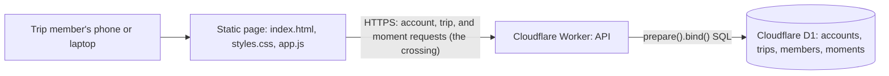

# ARCHITECTURE.md

Accountable: Giancarlo Martinez-Saldana, Phase 1 Architect. Weights were committed in their own commit before any option was scored; the commit history is the evidence.

## The Gate: Build, Buy, or Delegate

This gate applies to the first product slice described by the team: a casual,
photo-first travel diary for places a person has visited, with category
filtering. Ranking visited places by city and category is a future direction,
not a committed feature in this decision.

### Weights (committed before scores)

| Criterion | Weight (1 to 5) | Why this weight |
|---|---:|---|
| Supports the group-trip flow (F1 to F4: accounts, invites, moments, who added what) | 5 | These are the Must-be features in FEATURES.md. An option that cannot do shared trips fails the product. |
| Fits the course stack and STANDARDS.md | 4 | The team has built on static pages, Workers, and D1 in HW4 and HW5. An option outside that stack costs learning time we do not have. |
| Limits exposure of trip photos and notes | 5 | Photos and visit history reveal where people were and when. Fewer parties holding them means fewer crossings to account for. |
| Buildable and testable by the team in Phase 2 | 4 | Phase 2 is three weeks. We must be able to run, inspect, and fix the result ourselves. |
| Switching cost, scored from HW4 and HW5 experience | 3 | In HW4 and HW5, leaving our own Worker and D1 took one `wrangler d1 export` and a rewrite of one Worker. Leaving a hosted product means losing data or re-entering it, so this decides how reversible the choice is. |

### Scores (1 to 5)

| Criterion | Weight | Build: static page, Cloudflare Worker, D1 | Buy: off-the-shelf shared trip album (for example, Google Photos shared albums) | Delegate: bolt.new-generated and hosted app |
|---|---:|---:|---:|---:|
| Supports the group-trip flow (F1 to F4) | 5 | 5 | 3 | 4 |
| Fits the course stack and STANDARDS.md | 4 | 5 | 1 | 2 |
| Limits exposure of trip photos and notes | 5 | 4 | 2 | 2 |
| Buildable and testable by the team in Phase 2 | 4 | 4 | 2 | 3 |
| Switching cost, scored from HW4 and HW5 experience | 3 | 4 | 1 | 2 |
| **Weighted total (max 105)** | | **93** | **40** | **56** |

**Score rationale**

- **Build:** We control every screen and every row F1 to F4 needs, on the stack we used in HW4 and HW5. Exposure is a 4, not a 5, because data still crosses to Cloudflare. Buildability is a 4 because accounts and photo storage are new to us.
- **Buy:** A shared album handles photos and shows who added them, but not notes, places, search (F5), or our invite rules. It sits outside our stack, sends photos to another large vendor, and leaves nothing for us to build or test. Leaving it later means exporting albums by hand, so switching cost scores 1.
- **Delegate:** The bolt.new probe showed it can produce a plausible app quickly, but it guessed six things our spec did not say (PROBE-001). We would own code we did not write, hosted outside our stack, and moving off its hosting means rewriting the backend.

## ADR-001: Build the Travel App on Cloudflare Workers and D1

### Status

Accepted, 2026-10-08. Driver: Giancarlo Martinez-Saldana (Architect). Approver: Rishika Sikhakolli.

### Context

The team is building a group trip record (PROJECT.md): members sign up (F1), create a trip and invite others by link (F2), add moments with a photo, note, or place (F3), and see who added what (F4). Accounts and shared trips need a server; a browser-only app cannot share a trip between people.

The riskiest assumption in EVALS.md is that people add moments *during* a trip, not after. That makes capture speed on a phone the constraint that matters most, which favors a small static page and a single write endpoint over a large framework or hosted product.

**The crossing.** Account details (email, username, and a password hash, never the password itself), trip names, invite links, moments (photos, notes, places), member names on each moment, and request metadata including IP addresses leave the browser and go to Cloudflare (Workers for the API, D1 for storage), under Cloudflare's free-plan terms, in a region we do not choose. Aashi Mehta, who holds the Cloudflare account, is accountable for this crossing (TOOLS.md).

### Options

1. **Build:** static page, Cloudflare Worker, and D1, written by the team. Gate total 93.
2. **Buy:** an off-the-shelf shared trip album. Gate total 40.
3. **Delegate:** a bolt.new-generated and hosted app. Gate total 56.

### Decision

Build option 1. Structure lives in `index.html`, presentation in `styles.css`, and behavior in `app.js`; one Worker serves the API, and D1 stores accounts, trips, members, and moments. All SQL goes through `prepare().bind()` (STANDARDS.md). No other external service is added without a new ADR and a TOOLS.md row.

### Consequences

- Trip data stays with one vendor (Cloudflare), and the team controls every screen F1 to F4 needs.
- Leaving later is one `wrangler d1 export` and a rewrite of one Worker, as in HW4 and HW5.
- **Harder:** we now own account security. Storing password hashes, checking invite links, and blocking non-members from private trips (F2-2) are our bugs to prevent.
- **Harder:** D1 is built for rows of text, not large photos. Full-size phone photos may need resizing in the browser or a separate file store, which would require revising this ADR (see Giancarlo's Prediction Stake in EVALS.md).
- Data sits in a Cloudflare region we do not choose, under terms we do not negotiate.

### Revisit Trigger

Revisit by 2026-10-29 if photo uploads fail the test in Giancarlo's Prediction Stake, or if the RAT fails in user interviews by 2026-10-22.

## Architecture Diagram

