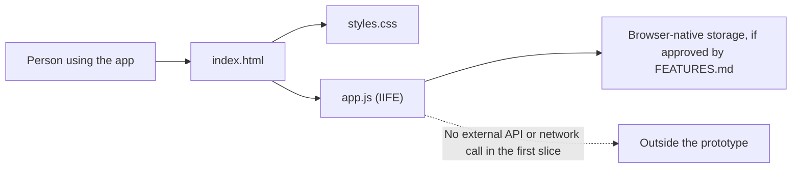

# ARCHITECTURE.md

Accountable: Giancarlo Martinez-Saldana, Phase 1 Architect. Weights were committed in their own commit before any option was scored; the commit history is the evidence.

## The Gate: Build, Buy, or Delegate

This gate applies to the first product slice described by the team: a casual,
photo-first travel diary for places a person has visited, with category
filtering. Ranking visited places by city and category is a future direction,
not a committed feature in this decision.

### Weights (committed before scores)

| Criterion | Weight (1 to 5) | Why this weight |
|---|---:|---|
| Supports the group-trip flow (F1 to F4: accounts, invites, moments, who added what) | 5 | These are the Must-be features in FEATURES.md. An option that cannot do shared trips fails the product. |
| Fits the course stack and STANDARDS.md | 4 | The team has built on static pages, Workers, and D1 in HW4 and HW5. An option outside that stack costs learning time we do not have. |
| Limits exposure of trip photos and notes | 5 | Photos and visit history reveal where people were and when. Fewer parties holding them means fewer crossings to account for. |
| Buildable and testable by the team in Phase 2 | 4 | Phase 2 is three weeks. We must be able to run, inspect, and fix the result ourselves. |
| Switching cost, scored from HW4 and HW5 experience | 3 | In HW4 and HW5, leaving our own Worker and D1 took one `wrangler d1 export` and a rewrite of one Worker. Leaving a hosted product means losing data or re-entering it, so this decides how reversible the choice is. |

### Scores

Scores are added in a separate commit after the weights above.
## ADR-001: Build a Browser-Only Travel Review Prototype

- **Status:** Status: Accepted, 2026-010-07. Driver: Semaj. Approver: Rishika.

### Context

The product concept is a casual travel-review app where people add visited
places with photos, ratings, and reviews, then browse using a category filter.
The future idea is to rank places by city and selected category. The repository
does not yet contain application source code.

### Options

1. Build a static, browser-only prototype using the web platform.
2. Buy or adopt a hosted review product or third-party SDK.
3. Delegate the product implementation to a code-generation service.

### Proposed Decision

Build option 1 in-house for the first prototype. If approved, keep structure in `index.html`, presentation in `styles.css`, and behavior in `app.js`; put application behavior inside an IIFE. Do not add a framework, external API, hosted database, or credential.

### Consequences

- The prototype avoids exposing review and photo data to an added server or third-party SDK.
- It can be served as static files and tested without service credentials.
- Local-only storage limits data to the current browser and device; it does  not provide accounts, synchronization, recovery, or community rankings.
- Browser storage capacity and photo handling must be tested before promising
  reliable storage of uploaded images.
- A future shared ranking feature may require a backend and a revised architecture decision; it must not bypass the team's trust and SQL-binding standards.

### Revisit Trigger

Revisit if creating this becomes a real possibility for an actual client. 

## Architecture Diagram

