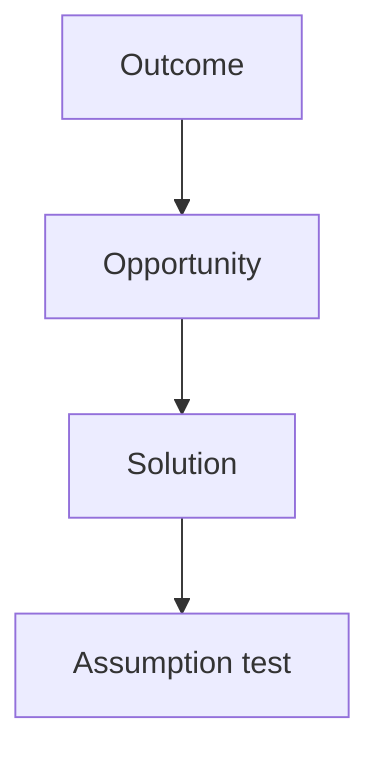

# EVALS.md

Stub from mgt3745-group-template. Accountable: the Reviewer (teams of five: the Evaluator from Phase 2).

## Opportunity Solution Tree

## Riskiest Assumption (RAT)

## Evals Planned for Phase 2

## Prediction Stakes

Each member commits their own stake, in their own commit, before any Phase 2 code. Predictions are never edited; results are written beneath them.

### Giancarlo (Architect), committed 2026-10-08

**Prediction:** Storing trip photos directly in D1 will not work at real phone-photo sizes. Before F3 (Add a moment) passes with photos taken on a phone, the team will need a separate file store (such as Cloudflare R2) or will have to shrink photos in the browser before upload.

**How we will check:** During Phase 2, three members each add one full-size phone photo to a test trip. If all three save and display through Workers and D1 alone, with no added service or resizing step, this prediction is wrong.

**Confidence:** 70%

**Why:** D1 is built for rows of text and numbers, not large files, and phone photos are often several megabytes. ADR-001 names only Workers and D1, so if this is right, ADR-001 will need a revision in Phase 2.
## Where the Stakes Disagree
