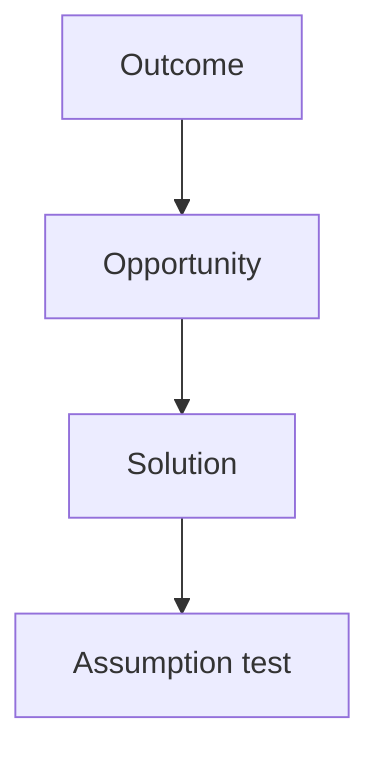

# EVALS.md

Stub from mgt3745-group-template. Accountable: the Reviewer (teams of five: the Evaluator from Phase 2).

## Opportunity Solution Tree

## Riskiest Assumption (RAT)

## Evals Planned for Phase 2

## Prediction Stakes

Each member commits their own stake, in their own commit, before any Phase 2 code. Predictions are never edited; results are written beneath them.

## Where the Stakes Disagree
