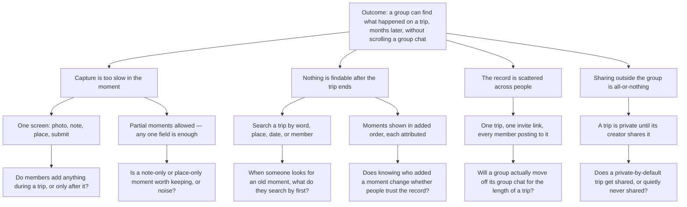

# EVALS.md

Status: ACTIVE. Accountable: Semaj Johnson II, Phase 1 Reviewer.

## Opportunity Solution Tree

## Riskiest Assumption (RAT)

**Assumption:** people will add moments *during* a trip, not after it.

**Why it is the riskiest:** every opportunity below the outcome depends on a record existing. Search (F5) has nothing to search, attribution (F4) has nothing to attribute, and sharing (F6) has nothing to share. If capture happens only after the trip — or not at all — the app is a photo album people fill out as homework, and the outcome is unreachable no matter how good the rest of the build is. It comes from A1, the leftmost assumption test in the tree.

**What would show it is false:** in user research by October 22, people describe taking photos during trips but writing anything down only afterward, if ever. In Phase 2, moments whose timestamps cluster after a trip's end date rather than during it.

**How we would test it cheaply:** ask the three interviewees for their last trip, and have them open their camera roll and their group chat and show us what they posted and when. Past behavior, not intention — the HW2 rule.

## Evals Planned for Phase 2

| What | Grader | Checks |
|---|---|---|
| Code eval, `evals/` run with `npm test` | Code | One test per Must-be EARS row with a server-side effect: F1-2 duplicate username, F2-2 join without a valid invite, F3-3 empty moment refused, F4-2 deleting someone else's moment refused. Each test names its EARS row in the title. |
| Judgment eval, `docs/JUDGMENT.md` | Rubric, two graders | At least ten binary questions covering the rows code cannot check: attribution visible on every moment, search terms preserved on an empty result, a private trip invisible to non-members. Two columns, disagreements marked. Agreement under 80 percent is a finding about the rubric. |
| Error-analysis log | Human | Every failure across the probe, the tests, and the judgment eval, counted and sorted. The most frequent failure is the next fix. |

## Prediction Stakes

Each member commits their own stake, in their own commit, before any Phase 2 code. Predictions are never edited; results are written beneath them.

### Semaj Johnson II, Reviewer — committed 2026-10-07

**Tight:** fewer than half of the moments created during Phase 2 testing will carry all three of photo, note, and place. F3-1 allows any one of them, and I expect people to use that permission constantly rather than occasionally.

*Result:*

**Loose:** search (F5) will be used less than we expect during Phase 2, because our test trips will be too short for anything to get lost in.

*Result:*

**Open:** when a trip has moments from more than one member, what do people look at first — the moments in order, or who added them? I do not know, and F4 treats both as equally important.

*Result:*

### Rishika Sikhakolli, Specifier — committed <2026-10-08>

**Prediction:** People might have things they want to add to the trip feeds that don't have all three criteria (photo, review, location name). F3-1 makes the note optional, members will mostly post a photo and a place, so searching by a word from the note (F5-1) will find fewer moments than searching by place, date, or member.

**How we will check:** During user testing, count what is added across all test trips. If the majority f them include a note, this prediction is wrong.

**Confidence:** 60%

**Why:** Profile 1 shares quickly and has little patience for writing, and the probe showed that requiring all three fields was a guess, so F3-1 now lets people skip the note. Profile 2 wants to say more than a caption, which is why I am not more confident. If this is right, F5 should treat place, date, and member as the main ways to search.

### Aashi Mehta, Implementer — committed <date>

*To be written and committed by Aashi.*

### Giancarlo Martinez-Saldana, Architect — committed <date>

*To be written and committed by Giancarlo.*

### Giancarlo (Architect), committed 2026-10-08

**Prediction:** Storing trip photos directly in D1 will not work at real phone-photo sizes. Before F3 (Add a moment) passes with photos taken on a phone, the team will need a separate file store (such as Cloudflare R2) or will have to shrink photos in the browser before upload.

**How we will check:** During Phase 2, three members each add one full-size phone photo to a test trip. If all three save and display through Workers and D1 alone, with no added service or resizing step, this prediction is wrong.

**Confidence:** 70%

**Why:** D1 is built for rows of text and numbers, not large files, and phone photos are often several megabytes. ADR-001 names only Workers and D1, so if this is right, ADR-001 will need a revision in Phase 2.
## Where the Stakes Disagree
