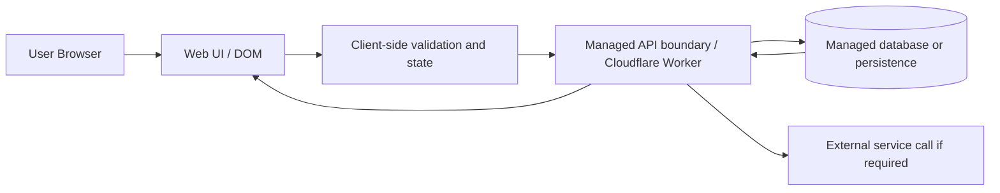

# ARCHITECTURE.md

Status: ACTIVE. Accountable: Giancarlo (Architect). This file records the architecture decision for the team's selected problem: a casual, photo-first travel diary for recording and rating places visited, browsing reviews by category, and eventually ranking places by city and category.

## The Gate: Build, Buy, or Delegate

### Weights (committed before scores)

| Criterion | Weight (1 to 5) | Why this weight |
|---|---:|---|
| Still wicked at team scale | 5 | The product must remain meaningfully complex when work is split across four contributors. |
| Users the team can reach by Oct 22 | 4 | A solution with accessible users is more likely to be validated in time. |
| Buildable on our stack in three weeks | 5 | The project is time-boxed and must be achievable within the course schedule. |
| Data we can get legally and soon | 4 | The architecture should rely on data we can obtain without legal or operational risk. |
| Meaning: at least three of us care | 4 | The solution needs enough team buy-in to stay realistic and motivating. |
| Switching cost from prior course work | 3 | The design should use known patterns and limit retooling burden. |

### Scores

| Option | Build in-house | Buy managed service | Delegate to external service |
|---|---:|---:|---:|
| Still wicked at team scale | 4 | 3 | 2 |
| Reach by Oct 22 | 4 | 4 | 3 |
| Buildable in three weeks | 5 | 4 | 2 |
| Data risk | 4 | 4 | 3 |
| Meaning to team | 4 | 3 | 2 |
| Switching cost | 4 | 3 | 2 |
| Weighted total | 87 | 70 | 48 |

### Decision

The team should build the core product in a browser-first application and buy only the minimal managed backend services required for persistence and data crossing. This keeps the product infrastructure small, easy to review, and consistent with the limited timeline.

## ADR-001: Browser-first app with a minimal managed backend

- **Status:** Accepted. Approver: Aashi Mehta.

### Context

The project is a course-based team build that must remain understandable, reviewable, and secure. The critical architecture decision is where data crosses the browser trust boundary: what leaves the browser, to which vendor-managed service, under which terms, and who is accountable for the boundary. The service boundary must be explicit and the repository must remain credential-free. The accountable owner for the service boundary is Aashi Mehta, Implementer; the product intent stays with the Specifier and the architectural decision stays with the Architect.

### Options

1. Build the entire experience in the browser with no server-side persistence beyond local storage or a mock store.
2. Build a browser-first experience and add a minimal managed backend for storage and API calls.
3. Delegate the core product logic to a vendor-managed service and build only a thin client.

### Decision

Use a browser-first application with a small managed server boundary for persistence and vendor-managed processing. The browser remains the primary product experience, while a minimal API layer handles the necessary data crossing and persistence. The likely trust boundary is browser-to-Cloudflare Worker or a similar managed runtime, followed by a managed database for storage, with all credentials kept out of the repository.

### Consequences

- The team can iterate quickly on the core user experience while keeping the backend small and reviewable.
- The architecture remains familiar to a small student team and fits the course time box.
- Data handling becomes explicit, which improves reviewability and reduces accidental secret exposure.
- A managed vendor introduces operational constraints, vendor terms, and a dependency that gets harder to avoid once the boundary is used.
- Some product changes become more complex because browser state and backend persistence must remain in sync.

### Revisit Trigger

Revisit this ADR if the team adds a data-retention requirement, user accounts, a richer backend contract, or a vendor dependency that materially changes the browser-to-server crossing.

## Architecture Diagram

This diagram matches ADR-001: the browser remains the main experience, and the only intentional trust boundary is the managed API layer where non-public data leaves the browser and enters vendor-controlled infrastructure.
